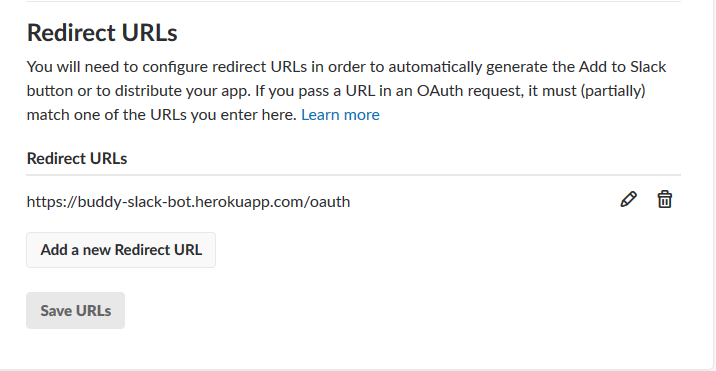
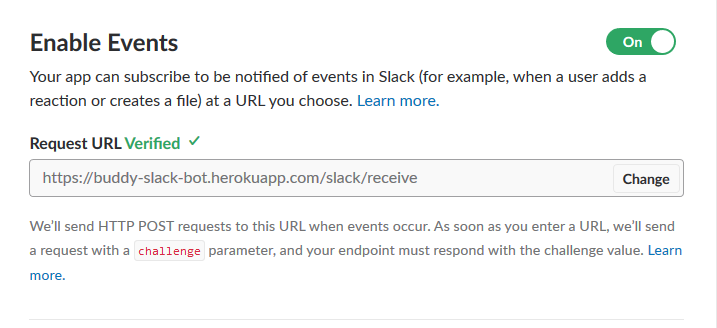

# Buddy Slack Bot :fire:

An awesome bot which will keep my team at zauba motivated

# Getting Started

1.  Install node.js from [Nodejs.org](https://nodejs.org/en/)

2.  Clone the repo

```
git clone https://github.com/ameerthehacker/buddy-slack-bot.git
```

3.  Run **npm install** in the root directory to install dependencies

4.  Create .env file in the root directory with the following configs

```
clientId=YOUR_SLACK_APP_ID
clientSecret=YOUR_SLACK_APP_SECRET
PORT=3000
```

5.  Expose yourself to the internet

    To do development in local you have to expose the port 3000 to the internet for that download and install [ngrok](https://ngrok.com/)

    After setting it up **ngrok** will give you a public url something like **http://4184a728.ngrok.io/**

6.  Change some settings in your slack app

    Go to the **OAuth & Permissions** section in your app and add the **redirect url**

    

    Go to **Event Subscriptions** section in your app and change the **request url**

    

7.  Execute **npm start** in the root directory to start the bot

# Reference Links

* [Botkit](https://github.com/howdyai/botkit)

## License

MIT © [Ameer Jhan](mailto:ameerjhanprof@gmail.com)
